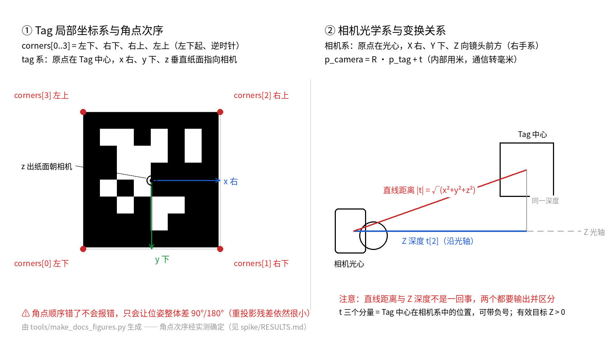

# 任务二：相机标定与 AprilTag 位姿

用**内置摄像头**识别 tag36h11 标记并输出三维位姿：先用自己的棋盘格完成相机标定，
再检测指定 ID 的 Tag，显示中心、角点与三维坐标轴，输出旋转矩阵 R、平移向量 t 与距离，
并正确处理镜头畸变。位姿结果按统一字段输出，供任务三按 CV1 协议经串口发送。

---

## 1. 开发与运行环境

| 项目 | 版本 / 说明 |
| --- | --- |
| 操作系统 | Ubuntu 26.04 LTS（实体机，非 WSL2） |
| 语言 | Python 3.14.4 |
| OpenCV | opencv-python 5.0.0.93 |
| 数值库 | numpy 2.5.3 |
| AprilTag 库 | **pupil-apriltags 1.0.4.post11**（家族 `tag36h11`；本项目用其检测接口，位姿用 `cv2.solvePnP` 解算） |
| 图像库 | Pillow 12.3.0（仅 `tools/make_patterns.py` 生成打印素材用） |
| 开发工具 | VS Code（Python / Pylance / Python Debugger） |
| 虚拟环境 | `~/Projects/PythonProjects/.venv`（项目上层，与 task1 共用） |

安装与自检：

```bash
cd task2
source ../.venv/bin/activate          # 或 ../.venv/bin/python main.py ... 直接跑
pip install -r requirements.txt

# 最小自检：版本 + 库都能用
python -c "import cv2, numpy, pupil_apriltags; print(cv2.__version__, numpy.__version__)"
python -c "from pupil_apriltags import Detector; d=Detector(families='tag36h11'); print('apriltag ok')"

# 不需要相机、不需要打印的链路回归测试（用仿真画面验证位姿正确性）
python tools/validate_pose_sim.py
```


## 2. 目录结构与职责划分

```text
task2/
├── main.py                     入口：demo（实时演示）/ calib（标定）/ check（查参数）
├── config.py                   唯一参数表：相机、Tag、标定板、位姿、显示、路径
├── requirements.txt
├── src/
│   ├── camera.py               取流：打开相机、设 MJPG/分辨率、抓帧
│   ├── tag_detect.py           检测：画面里有哪些 Tag（ID、中心、四角、hamming、margin）
│   ├── target.py               目标选择与有效性判定：哪个是我要的、结果能不能用
│   ├── pose.py                 位姿解算：R、t、rvec、直线距离、Z 深度、坐标轴点
│   ├── undistort.py            畸变处理：去畸变并保证内参与画面成对
│   ├── calibration.py          标定：棋盘格角点 → 内参/畸变/分辨率/重投影误差
│   ├── visualize.py            只画图：框、中心、角点、三维坐标轴、HUD
│   ├── pipeline.py             单帧串联 + 计时；输出任务三要用的字段
│   └── simulate.py             仿真画面渲染（回归测试用，不参与实时流程）
├── tools/
│   ├── make_patterns.py        生成打印级 AprilTag 与棋盘格（A4/A3，尺寸精确）+ 手机屏幕测试图
│   ├── make_docs_figures.py    生成 README 用的坐标系/角点次序示意图
│   ├── capture_calib.py        采集标定图：实时预览 + 3x3 覆盖率提示 + 存图
│   ├── probe_camera.py         探测相机真实能力：支持的格式/分辨率、控制项（含对焦/曝光）
│   └── validate_pose_sim.py    位姿链路回归测试（不需要相机与打印）
├── spike/                      前期可行性验证与结论（提交前可删）
├── assets/patterns/            打印素材（tag、棋盘格、手机屏幕测试图）
├── assets/docs/                README 引用的示意图
├── data/calib_images/          标定原图
├── data/calib_params.json      标定结果：K、D、分辨率、RMS、逐图误差
├── data/measurements.md        打印素材实测记录（评分项要求留痕）
└── outputs/                    演示视频、日志、截图、逐帧位姿 JSONL（文件名见 3.1 节）
```

职责划分对应考核要求：**输入与参数**在 `main.py` + `config.py`；
**检测与位姿**在 `tag_detect.py` / `target.py` / `pose.py`；
**结果显示**只在 `visualize.py`；**相机与畸变**在 `camera.py` / `undistort.py`；
**通信输出与视觉处理分开**——`pipeline.py` 只产出字段（`PoseFrame.record()`），
串口报文格式与发送在任务三实现，本任务不含任何串口代码。

## 3. 运行方式

所有命令都在 `task2` 目录下执行。

```bash
# ⓪ 先确认相机能力
python tools/probe_camera.py                                         # 只打印到终端

# ① 生成打印素材（已经生成过，改了尺寸才需要重跑）
python tools/make_patterns.py --tag-mm 100 --square-mm 20            # A4
python tools/make_patterns.py --square-mm 25 --page a3               # 25 mm 方格要 A3
#   -> assets/patterns/ 下的 PDF 与 PNG

# ② 采集标定图（SPACE 存图，q/ESC 退出；自动连拍用 --auto）
python tools/capture_calib.py
python tools/capture_calib.py --auto 20 --interval 1.5
#   -> data/calib_images/calib_NNN.png（接着已有张数编号，不覆盖旧图）

# ③ 标定并保存参数
python main.py calib                                                 # -> data/calib_params.json

# ④ 实时演示：检测 + 位姿 + 显示
python main.py demo
python main.py demo --record --seconds 60        # -> outputs/videos/task2_pose_demo.mp4
                                                 #    outputs/logs/task2_pose_demo.txt
python main.py demo --record --dump outputs/logs/pose.jsonl   # 另存逐帧完整位姿（含 R 矩阵）
python main.py demo --no-calib                   # 还没标定时先看检测通路（位姿数值不可信）
python main.py demo --no-calib --tag-mm 73       # 用手机屏当 Tag 时，临时指定实测边长
#   演示中按 s -> outputs/screenshots/shot_NNNNNN.png（NNNNNN = 帧序号，从 0 起）

# ⑤ 查参数、核对分辨率是否成对
python main.py check --camera 0                                      # 只打印到终端

# ⑥ 重新生成 README 用的示意图（改了约定才需要）
python tools/make_docs_figures.py                                    # -> assets/docs/frames_and_corners.png
```

### 3.1 各命令的输出路径

| 命令 | 产物 | 输出路径 |
| --- | --- | --- |
| `tools/probe_camera.py` | 无文件 | —（只打印相机能力） |
| `tools/make_patterns.py` | 打印素材：tag 页、棋盘格页、手机屏测试图、官方图案原件 | `assets/patterns/`，默认文件名：`tag36h11_00000_official.png`、`apriltag_36h11_id0_100mm.pdf`（+`.png`）、`chessboard_9x6_20mm.pdf`（+`.png`）、`apriltag_36h11_id0_phone_screen.png`（名字随 `--tag-mm/--square-mm/--tag-id` 变） |
| `tools/make_docs_figures.py` | 坐标系与角点次序示意图 | `assets/docs/frames_and_corners.png` |
| `tools/capture_calib.py` | 标定原图（每存一张一个文件） | `data/calib_images/calib_NNN.png`；序号从目录已有张数接着排，**不覆盖旧图**；`--outdir` 可改 |
| `main.py calib` | 内参、畸变、分辨率、RMS、逐图误差 | `data/calib_params.json`；`--out` 可改 |
| `main.py demo --record` | 演示视频、逐帧日志 | `outputs/videos/task2_pose_demo.mp4`、`outputs/logs/task2_pose_demo.txt`（同名旧文件会被覆盖；打不开视频写入器时只给 `[警告]` 并仍然写日志） |
| `main.py demo --dump <路径>` | 逐帧完整位姿 JSONL（含 R 矩阵） | 由 `--dump` 指定，例如 `outputs/logs/pose.jsonl`；**不指定就不写文件**；同名旧文件会被覆盖 |
| `main.py demo` 中按 `s` | 当前帧截图 | `outputs/screenshots/shot_NNNNNN.png`（NNNNNN = 帧序号） |
| `main.py check` | 无文件 | —（只打印参数与分辨率核对结果） |
| `tools/validate_pose_sim.py` | 无文件 | —（只打印误差表，见第 8 节） |

`outputs/{videos,logs,screenshots}`、`data/calib_images` 与 `assets/patterns` 在首次运行时自动创建，不需要手动建目录；
所有路径都定义在 `config.py` 的「路径」与「输出目录」两节。

| 参数 | 默认值 | 含义 |
| --- | --- | --- |
| `demo --camera/--width/--height` | `0 / 1280 / 720` | 相机索引与请求分辨率（见第 4 节，MJPG 才能上 720p） |
| `demo --seconds` | `0` | 运行秒数，0 = 不限，按 q/ESC 退出 |
| `demo --max-frames` | `0` | 只处理前 N 帧 |
| `demo --record` | 关 | 保存演示视频与逐帧日志到 `outputs/` |
| `demo --dump` | 关 | 逐帧完整位姿写 JSONL（含 R 矩阵、rvec、距离、耗时），可核对也可给任务三用 |
| `demo --tag-mm` | `config.TAG_EDGE_MM` | 临时覆盖 Tag 实测边长（用手机屏当 Tag 时用） |
| `demo --target-id` | `config.TARGET_ID` | 临时覆盖要选中并发布位姿的 Tag ID |
| `demo --no-calib` | 关 | 不加载标定参数（仅通路自测，**位姿数值不可信**） |
| `calib --inner-cols/--inner-rows/--square-mm` | `9 / 6 / 20.0` | 标定板规格，必须与实际打印一致 |
| `calib --images` | `data/calib_images` | 标定图片目录 |

## 4. 摄像头接入

先跑一次诊断工具，确认相机到底能给什么（换机器/换相机时也同样先跑它）：

```bash
python tools/probe_camera.py
```

本机（唯一一个彩色相机）的实测结果：

| 设备 | 说明 | 可用格式与分辨率 |
| --- | --- | --- |
| `/dev/video0`（cv2 索引 0） | **本任务使用的彩色相机** | MJPG：800×800、1920×1080、1280×720、960×540、640×480、640×360…；YUYV：只到 640×480 |
| `/dev/video1` | 上者的元数据节点，不能取流 | — |
| `/dev/video2`（cv2 索引 2） | **同一模块的红外接口**，只有灰度，不能当第二路彩色用 | GREY：640×360、360×360 |
| `/dev/video3` | 上者的元数据节点 | — |

四个节点来自**同一个 USB 设备**（`usb-0000:00:14.0-4`，uvcvideo）：接口 1.0 是 RGB、1.2 是 IR。
也就是说本机**只有一个可用的彩色相机**，索引 0；索引 2 是红外，画面是灰度的，不适合本任务。

**取流的三条硬性经验：**

1. **必须先设 FOURCC 再设分辨率**，不设 MJPG 时驱动只给 640×480（`src/camera.py` 已按此顺序实现）。
2. **读回实际分辨率再继续**——驱动可能拒绝你的设置，而“内参必须与画面分辨率成对”，
   `main.py demo` 启动时会打印实际分辨率并与标定分辨率核对。
3. 相机被浏览器/会议软件占用时会打不开，报错信息里已给出提示。

**对焦**：该相机不提供 `focus_auto` / `focus_absolute` 控制项，属**固定焦距**。
好处是不会出现“标定之后重新对焦导致内参漂移”的问题；代价是不能调焦，
Target 太近（约 20～30 cm 以内）会发虚。建议 Tag 工作在 **30～80 cm**。

**曝光**：默认是**自动曝光**（`exposure_auto=3`，本机实测）。自动曝光在靠近/远离时会自动改变亮度，
一般够用；若远处 Tag 检测不稳定，把 `config.CAMERA_LOCK_EXPOSURE` 改成 `True` 锁死手动曝光
（本机实测可锁，范围 2～1250，当前值 156）。程序会回读确认，没锁上会明确告诉你，不会假装锁上了。

## 5. 坐标系、单位与角点次序

**相机光学坐标系**：原点在相机光心，X 向右、Y 向下、Z 向镜头前方（右手系，Z 是光轴）。
**Tag 局部坐标系**：原点在 Tag 中心，x 右、y 下、z 垂直纸面指向相机；
“上下左右”指**打印好的 Tag 正着看（方向标记朝上）**时的方向 —— 打印素材上已印方向标记。

变换关系（任务三也按这个定义发数据）：

```text
p_camera = R · p_tag + t
```

* `t`（单位米）= Tag 中心在相机系中的位置；`t[2]` 是沿光轴的**深度**。
* **直线距离** = `sqrt(x² + y² + z²)`，与 Z 深度不是一回事，HUD 里两个都显示。
* 单位约定：**程序内部统一用米**，只有通信时换算成毫米（`PoseFrame.record()` 已转好）。

**角点次序（实测确定，务必别改）**：`pupil_apriltags` 返回的 `corners[0..3]` 依次是

| 索引 | tag 系坐标 | 位置 |
| --- | --- | --- |
| `corners[0]` | `(-s/2, +s/2, 0)` | 左下 |
| `corners[1]` | `(+s/2, +s/2, 0)` | 右下 |
| `corners[2]` | `(+s/2, -s/2, 0)` | 右上 |
| `corners[3]` | `(-s/2, -s/2, 0)` | 左上 |

即以左下角为起点、逆时针，与 AprilTag 官方文档一致。`src/pose.py` 的角点顺序必须与此一致，
**不要按自己的习惯重排**：错了不会报错，只会让位姿整体差 90°/180°，而且重投影残差依然很小。



上图由 `python tools/make_docs_figures.py` 生成：左半是 Tag 局部坐标系与角点次序（含 z 轴朝向），
右半是相机光学系、`p_camera = R·p_tag + t` 的变换方向，以及**直线距离与 Z 深度的区别**。

> 另外注意：**官方图案与 `cv2.aruco` 生成的同 ID 图案相差 180°**。
> 本项目的打印素材与 objp 都以官方图案为准。

## 6. 打印素材与实测

`tools/make_patterns.py` 生成（尺寸由程序保证，PDF 内经 MediaBox 校验）：

| 文件 | 内容 |
| --- | --- |
| `assets/patterns/tag36h11_00000_official.png` | 官方图案原件（来自 AprilRobotics/apriltag-imgs） |
| `assets/patterns/apriltag_36h11_id0_100mm.pdf` | A4 竖版：黑框外边 **100.0 mm**，含方向标记与 100 mm 校验尺 |
| `assets/patterns/chessboard_9x6_20mm.pdf` | A4 横版：9×6 内角点，方格 **20.0 mm**，含校验尺 |

操作要求：

1. **打印选“实际大小 / 100%”**，不要用“适合页面”缩放；打完先量页内 100 mm 校验尺，
   偏差超过约 1 mm 就重新打印。
2. 整张贴平在硬板上，不要折叠、不要覆膜（反光会让检测失败）。
3. **打印后实测并把实测值填进 `config.py`**：
   * Tag 的**黑框外边**边长（不是整张纸、也不是含白边的宽度）→ `TAG_EDGE_MM`
   * 棋盘格的方格边长 → `BOARD_SQUARE_MM`
   程序用的是实测值，标称值只是参考。**同时把实测值记到 `data/measurements.md`**
   （评分项要求“有效边长测量与记录正确”，只填进配置不留记录是不完整的）。

### 6.1 采集标定图的操作步骤（可以用手机屏先试）

```bash
python tools/capture_calib.py        # SPACE 存图，q/ESC 退出；也可 --auto 20 --interval 1.5
```

1. **先固定相机**：笔记本放桌上、屏幕角度定好就不要再动；相机不动，动棋盘格。
2. 手拿棋盘格（贴平在硬板上、不要折），距离在 **30～70 cm** 之间变化，别贴太近（本机固定焦距，太近会糊）。
3. 依次把棋盘格放到画面的**九个区域**（左/中/右 × 上/中/下），界面上的 3×3 覆盖计数会实时提示还缺哪里；
   理想是 9 个区域都拍到。
4. 每个位置**改变倾斜方向**（左右各倾 ~±30°、上下各倾 ~±20°），不要只拍正对的。
5. 每个位置**停稳再按空格**；存图时会立刻校验角点，提示“未找到”的那张基本会被标定跳过，建议补拍。
6. 累计 **15～25 张**（有效图不少于 8 张才会出结果），然后：

```bash
python main.py calib                 # 看采用/跳过张数、RMS、最差几张
python main.py check --camera 0      # 核对标定分辨率与相机实际分辨率是否一致
```

> 还没打印时可以先试通路：`python tools/make_patterns.py --screen` 生成手机屏幕用的 tag 图，
> 传到手机全屏显示，量出屏幕上黑框外边的实际毫米数后
> `python main.py demo --no-calib --tag-mm <实测值>` —— 检测、显示、状态切换都能先验证，
> 只是没标定时位姿数值不准。

## 7. 标定流程与重投影误差

1. 采集 15～25 张清晰图：**覆盖画面中部与四角**，改变**距离**与**倾斜方向**，
   棋盘格角点要完整可见、不要只拍一堆几乎一样的正对照。`capture_calib.py` 的 3×3 覆盖图会实时提示。
2. 每张图的**分辨率必须一致**（与后面检测时也一样），否则内参不能共用，程序会跳过不一致的图。
3. `python main.py calib` 调用 `cv2.calibrateCamera`，保存 `data/calib_params.json`：
   内参 `K`、畸变 `D`（k1,k2,p1,p2,k3）、标定分辨率、`calibrateCamera` 的 RMS、
   **每张图的平均重投影误差**、标定板规格、用到的与跳过的图片清单。
4. **重投影误差的含义**：用解出的内参把棋盘格角点从三维投回图像，与图像上实际检测到的
   亚像素角点之差（像素）。它衡量标定本身的拟合质量，**不直接等于位姿精度**
   （位姿还受角点检测噪声、Tag 边长测量误差、Tag 平整度影响）。本机实测 RMS 见
   `main.py calib` 输出与 `data/calib_params.json`。

## 8. 畸变处理策略

采用：`cv2.undistort(frame, K, D)`，**不裁剪、不改内参**（输出画面的内参仍是 K），
之后检测与解算一律用 `K` + `dist=0`。这样“解算用的内参”和“画面”天然成对。

依据（`tools/validate_pose_sim.py` 可复跑，仿真画面 + 已知真值 + 桶形畸变 k1=-0.28,k2=0.11）：

| 场景 | A 原图+畸变系数解算 | **B 去畸变后 dist=0（本方案）** | C 内参误用半分辨率（对照） |
| --- | --- | --- | --- |
| 正对 0.8 m | 5.01 mm / 1.14° | **4.16 mm / 0.24°** | 590 mm / 1.4° |
| 倾斜 0.75 m | 1.88 mm / 0.17° | **1.19 mm / 0.16°** | 551 mm / 39° |
| 强倾斜 45° 0.55 m | 0.79 mm / 0.19° | **0.47 mm / 0.22°** | 399 mm / 65° |

（数值为解出 t 与真值 t 的欧氏距离，以及旋转矩阵夹角）

C 列是故意做错的对照，用来说明**内参与画面分辨率必须成对**——错配时 Z 深度会成倍偏掉，
而且画面看起来完全正常。`main.py demo` 启动时也会检查标定分辨率与相机实际分辨率是否一致并告警。

**位姿解算为什么用 SQPNP**：`SOLVEPNP_IPPE_SQUARE` 按 OpenCV 文档要求物体点 y 向上、特定次序，
本项目的 Tag 系是 y 向下（与相机光学系同向），直接喂进去会得到**镜像解**
（实测旋转误差 180°、平移取反，而重投影残差却极小，很容易漏掉）。
`SOLVEPNP_SQPNP` 不挑剔点序，与真值一致。

## 9. 输出与演示

`main.py demo --record` 产出：

* `outputs/videos/task2_pose_demo.mp4`：画面上叠加
  **角点编号、中心点、选中目标（绿框）、其它检测到的 Tag（淡红框）、三维坐标轴**（X 红 Y 绿 Z 蓝），
  左上角 HUD 显示：`valid`、`id`、`t` 三轴（米）、**直线距离与 Z 深度**、`rvec`、重投影残差、
  帧号、序号、本帧耗时、本帧检测到的 Tag 数量。
* `outputs/logs/task2_pose_demo.txt`：逐帧一行，字段与任务三报文一一对应：

```text
seq      0 | t       0 ms | valid 1 | id   0 | x    123.4 y    -45.6 z    812.3 mm | |t|   823.1 mm | cost  18.6 ms
```

`PoseFrame.record(seq, t_ms)` 返回的字段就是任务三要发的数据：
`seq`（从 0 递增）、`t_ms`（相对程序启动的单调毫秒）、`valid`、`id`（无效为 -1）、
`x_mm/y_mm/z_mm`、`rx/ry/rz`（**Rodrigues 旋转向量，弧度**，不是欧拉角）、`distance_mm`。
无效时坐标与姿态一律置零、`id=-1`，是否有效只看 `valid`。

**演示拍摄建议**：固定相机手持 Tag（或固定 Tag 移动相机），缓慢改变距离与倾角，
覆盖“目标出现 → 移出画面消失 → 再次出现”，这正是任务三需要演示的状态切换。

## 10. 边界情况与异常处理

| 情况 | 处理 | 位置 |
| --- | --- | --- |
| 打不开相机 / 相机被占用 | 打印 `[错误]` 与排查提示，返回退出码 1 | `main.py` 捕获 `CameraError` |
| 相机中途断开或流结束 | 打印提示并正常收尾，释放相机与写入器 | `main.py` 主循环 `read()` 判定 |
| 未检测到指定 ID | `valid=False`，原因写明，HUD 与日志都反映，**不沿用上一帧旧位姿** | `src/target.py` |
| 解码有误 / 检测质量低 / 目标在相机后方 / 解算失败 | 同上，`valid=False` 并给出具体原因 | `src/target.py`、`src/pose.py` |
| 保留全部检测结果 | 每帧返回全部 Tag，`select_target` 只按 ID 挑目标（同 ID 多个取 margin 最大的） | `src/tag_detect.py`、`src/target.py` |
| 没有标定参数 | 报错并给出两条出路（先标定 / `--no-calib` 只看检测） | `main.py` |
| 标定分辨率与相机分辨率不一致 | 启动时告警，说明位姿会偏差 | `main.py`、`src/undistort.py` |
| 标定图片太少 / 角点找不到 | 跳过找不到角点的图并列出；有效图少于 8 张则判标定失败并说明 | `src/calibration.py` |
| 输出目录不存在 | 运行前自动创建 | `main.py` `_ensure_dirs()` |

## 11. 已知问题

1. **OpenCV 5.0.0.93 + apriltag 库在解释器退出（或释放函数局部变量）阶段会随机段错误**，
   实测退出码 139；更麻烦的是**输出可能整段丢失**——重定向到文件时缓冲区还没落盘就崩了
   （同一脚本用 `-u` 能看到完整输出、退出码却是 139）。
   定位过程：单独跑渲染 / 检测 / 棋盘格 / 去畸变 / 解算都稳定，**崩点集中在 `main()` 返回
   释放局部变量那一步**。本项目所有入口都用同一套写法绕开：
   返回前先 `flush` + 把重对象挂在模块级 `_KEEP_ALIVE` 上活到 `os._exit` + `os._exit(code)`
   带退出码退出。改完连跑 3 轮、四个入口退出码全为 0、输出完整。
   新增脚本若同时用 `cv2` 与 apriltag 检测，建议照抄这个写法，否则退出码不可信。
2. **py3.14 没有 apriltag 预编译轮子**，首次 `pip install pupil-apriltags` 会本地编译（约 2 分钟），
   需要 `cmake`、`g++`、`python3.14-dev`。
3. **不设 MJPG 只能拿 640×480**（见第 4 节），这是最容易踩且不自知的坑。
4. 手动对焦/自动对焦：自动对焦相机在标定与检测之间若重新对焦，内参会漂移，
   建议固定焦距后再标定。本机相机未见自动对焦问题，但换个相机要注意。
5. `--no-calib` 用的是经验内参（f≈宽度像素），只用于验证通路，**位姿数值没有意义**。
6. A4 上棋盘格只做到 20 mm 方格：25 mm 的板（250×175 mm）加页眉与校验尺要 240 mm，
   超过 A4 横版 210 mm，需 `--page a3`。
7. 本机未配置打印机（`lpstat` 无目标），打印需在打印店或其他机器完成，注意选“实际大小”。

## 12. 参考来源

| 来源 | 用途 |
| --- | --- |
| 考核手册任务二正文（Tag 家族/边长、标定建议、坐标系与单位要求） | 任务要求 |
| [OpenCV Camera Calibration](https://docs.opencv.org/4.5.2/dc/dbb/tutorial_py_calibration.html) | `calibrateCamera`、角点检测、重投影误差 |
| [相机标定（知乎）](https://zhuanlan.zhihu.com/p/30813733)（手册提供） | 成像模型与畸变 |
| [MATLAB 标定工具（CSDN）](https://blog.csdn.net/weixin_45718019/article/details/105823053)（手册提供） | 备选标定途径 |
| [pupil-apriltags](https://github.com/pupil-labs/apriltags) | 检测接口与角点次序 |
| [AprilRobotics/apriltag-imgs](https://github.com/AprilRobotics/apriltag-imgs) | 官方 tag36h11 图案 |
| [AprilTag 官方站](https://april.eecs.umich.edu/software/apriltag) | 家族定义与位姿说明 |
| OpenCV `solvePnP` / `SOLVEPNP_SQPNP` / `undistort` / `drawFrameAxes` 文档 | 位姿与坐标轴绘制 |

## 13. 提交物清单（任务二部分）

| 材料 | 位置 |
| --- | --- |
| 源码与参数表 | `main.py`、`config.py`、`src/`、`tools/` |
| 打印 Tag 的实测尺寸 | `data/measurements.md`（记录表）与 `config.py:TAG_EDGE_MM`（程序参数） |
| 坐标系与角点次序说明图 | `assets/docs/frames_and_corners.png`（README 第 5 节引用） |
| 标定原图 | `data/calib_images/` |
| 标定参数文件 | `data/calib_params.json`（含内参、畸变、分辨率、RMS、逐图误差） |
| 位姿检测演示 | `outputs/videos/task2_pose_demo.mp4`（含距离与角度变化） |
| 演示日志（含 R、t 完整输出） | `outputs/logs/task2_pose_demo.txt` |
| 逐帧完整位姿（可选，含 R 矩阵） | `outputs/logs/pose.jsonl`（用 `demo --dump` 指定路径生成） |
| 链路回归证据 | `python tools/validate_pose_sim.py` 的输出（本 README 第 8 节表格） |

## 14. 版本核对

```bash
python -c "import sys, cv2, numpy, pupil_apriltags; print(sys.version.split()[0], cv2.__version__, numpy.__version__, pupil_apriltags.__version__)"
```

把输出填回第 1 节的版本表格即可。
